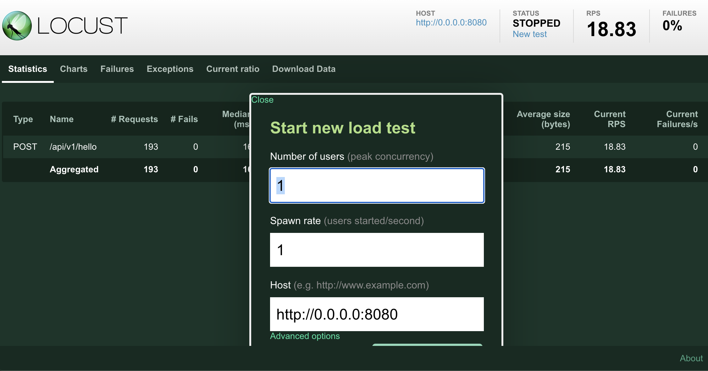

# k8s-fast (kubernetes-fastapi)

Python FastAPI with Dockerfile and configuration for Kubernetes

## Python Virtual Environment 

https://docs.python.org/3/tutorial/venv.html 

    you@you % python3 -m venv venv
    you@you % source venv/bin/activate
    (venv) you@you % 

## fastAPI Development setup

To run (in isolation), either:

Run from active Python environment using `uvicorn`:

    pip install -r requirements.txt
    uvicorn service.main:app --host 0.0.0.0 --port 8080 --reload

Or

Build and run the Docker container:

    docker build -t clam004/k8s-fast:1.0 .
    docker run -d -p 8080:8080 --name k8s-fast clam004/k8s-fast:1.0

Navigate to http://localhost:8080/docs to test the API.


The API responds with a greeting, and the result of a long-running calculation of the largest prime factor of a random integer. You should see a response body similar to:

    {
      "message1": "Hello, world!",
      "message2": "The largest prime factor of 1462370954730 is 398311. Calculation took 0.006 seconds.",
      "n": 1462370954730,
      "largest_prime_factor": 398311,
      "elapsed_time": 0.0057561397552490234
    }

## Before using Kubernetes Push the container image to Docker Hub

If you dont already, you need to have docker and your docker daemon running, a DockerHUb account and to be signed into it in terminal

    docker login

push the container to Docker Hub, and change all references to the image accordingly. Replace "clam004" with your Docker Hub ID:

    docker push clam004/k8s-fast:1.0

You may also need to make the image public as well.

## Get minikube and kubectl

Next, if you dont already, you need local Kubernetes and a command line tool for communicating with a Kubernetes cluster's control plane, using the Kubernetes API. This tool is named kubectl. https://kubernetes.io/docs/tasks/tools/install-kubectl-linux/ 

    brew install kubectl 

A local Kubernetes is minikube https://minikube.sigs.k8s.io/docs/start/ 
You wont be able to use $ kubectl until after you have started a control plane node minikube in cluster minikube

    minikube start

### you need a metrics server for horizontal pod scaling

https://www.bogotobogo.com/DevOps/Docker/Docker-Kubernetes-Horizontal-Pod-Autoscaler.php

metrics-server monitoring needs to be deployed in the cluster to provide metrics via the resource metrics API, as Horizontal Pod Autoscaler uses this API to collect metrics:

    (venv) you@you % minikube addons enable metrics-server

or

    (venv) you@you % kubectl apply -f https://github.com/kubernetes-sigs/metrics-server/releases/download/v0.4.1/components.yaml 

You need to edit this file 

    (venv) you@you % kubectl edit deployments.apps -n kube-system metrics-server  

to include `- --kubelet-insecure-tls=true` in the location below.

```
    spec:
      containers:
      - args:
        - --cert-dir=/tmp
        - --secure-port=4443
        - --kubelet-insecure-tls=true
        - --kubelet-preferred-address-types=InternalIP,ExternalIP,Hostname
```

## Kubernetes deployment

    kubectl apply -f api.yaml

If working locally, e.g. using `minikube`, use port forwarding to expose the service:

    (venv) you@you % kubectl apply -f api.yaml
    service/kf-api-svc created
    deployment.apps/kf-api created

    (venv) you@you %  kubectl port-forward service/kf-api-svc 8080
    Forwarding from 127.0.0.1:8080 -> 8080
    Forwarding from [::1]:8080 -> 8080
    Handling connection for 8080

Once you do this you will be able to find your fastAPI docs at http://localhost:8080/docs, http://127.0.0.1:8080/docs, or http://0.0.0.0:8080/docs 
which are all the same thing. 

To scale the deployment, apply a HorizontalPodAutoscaler. Either:

    (venv) you@you % kubectl apply -f autoscale.yaml 
    horizontalpodautoscaler.autoscaling/kf-api-hpa created

or:

    (venv) you@you % kubectl autoscale deployment kf-api --cpu-percent=50 --min=1 --max=10
    horizontalpodautoscaler.autoscaling/kf-api autoscaled

Check the current status of autoscaler

    (venv) you@you % kubectl get hpa
    NAME         REFERENCE           TARGETS         MINPODS   MAXPODS   REPLICAS   AGE
    kf-api-hpa   Deployment/kf-api   1%/50%          1         10        1          10h

    (venv) you@you % kubectl get hpa kf-api --watch    
    NAME     REFERENCE           TARGETS   MINPODS   MAXPODS   REPLICAS   AGE
    kf-api   Deployment/kf-api   2%/50%    1         10        1          113s


For continuous monitoring

    (venv) you@you % kubectl get hpa -w

## Load testing with Locust

in a file called locustfile.py you progam the test you want to run

```python
from locust import HttpUser, task

class LoadTesting(HttpUser):
    @task
    def hello_world(self):
        self.client.post("/api/v1/hello", json={})
```

Use `locust` to simulate a high load on the API

    pip install locust
    locust
    (k8_env) you@you % locust
    [2023-04-27 18:51:08,066] ..../INFO/locust.main: Starting web interface at http://0.0.0.0:8089 (accepting connections from all network interfaces)

this will deploy the browser interface to http://0.0.0.0:8089 

to test the endpoint http://0.0.0.0:8080/api/v1/hello/ 

enter http://0.0.0.0:8080 into the Host input field 




As Locust swarms your endpoint, you should see the usage go up on your horizontal pod scaler

    (venv) you@you % kubectl get hpa kf-api --watch    
    NAME     REFERENCE           TARGETS   MINPODS   MAXPODS   REPLICAS   AGE
    kf-api   Deployment/kf-api   2%/50%    1         10        1          113s
    kf-api   Deployment/kf-api   22%/50%   1         10        1          2m45s
    kf-api   Deployment/kf-api   323%/50%   1         10        1          3m45s
    kf-api   Deployment/kf-api   323%/50%   1         10        4          4m
    kf-api   Deployment/kf-api   323%/50%   1         10        7          4m15s
    kf-api   Deployment/kf-api   308%/50%   1         10        7          4m45s
    kf-api   Deployment/kf-api   47%/50%    1         10        7          5m45s
    kf-api   Deployment/kf-api   47%/50%    1         10        7          6m45s

you should see that if the TARGETS ratio goes above 50%:50%, more REPLICAS are spun up
to meet that demand, bringing down the ratio below 50%:50%

you can see allt he new pods that have been spun up

    (venv) carson@cc-laptop-carson k8s-fast % kubectl get pods
    NAME                      READY   STATUS    RESTARTS       AGE
    kf-api-5464676b6f-594l2   1/1     Running   0              4m45s
    kf-api-5464676b6f-68klv   1/1     Running   1 (105m ago)   5h15m
    kf-api-5464676b6f-gz555   1/1     Running   0              4m30s
    kf-api-5464676b6f-nrxjw   1/1     Running   0              4m30s
    kf-api-5464676b6f-q95mp   1/1     Running   0              4m45s
    kf-api-5464676b6f-vhdpp   1/1     Running   0              5m45s

## Teardown Kubernetes

    kubectl delete deployment kf-api
    kubectl delete svc kf-api-svc
    kubectl delete hpa kf-api-hpa

## Acknowledgements

Inspiration and code for FastAPI setup:
[How to continuously deploy a fastAPI to AWS Lambda with AWS SAM](https://iwpnd.pw/articles/2020-01/deploy-fastapi-to-aws-lambda).

## helpful links 

https://www.linuxsysadmins.com/service-unavailable-kubernetes-metrics/

https://stackoverflow.com/questions/54106725/docker-kubernetes-mac-autoscaler-unable-to-find-metrics 


## helpful snippets

## Trouble shooting your deployment

To see the logs that would have been streamed to you in your terminal had you done `uvicorn service.main:app --host 0.0.0.0 --port 8080 --reload` only to view those outputs within your pod/container, https://stackoverflow.com/questions/39454962/kubectl-logs-continuously,  get the name of your pod:

    (venv) % kubectl get pods 
    NAME                      READY   STATUS    RESTARTS      AGE
    kf-api-5464676b6f-68klv   1/1     Running   1 (91m ago)   5h1m

and use that name to follow that pod's outputs in real time using `kubectl logs -f <pod-id>`

    (venv) carson@cc-laptop-carson k8s-fast % kubectl logs kf-api-5464676b6f-68klv --follow
    INFO:     Started server process [1]
    INFO:     Waiting for application startup.
    INFO:     Application startup complete.
    INFO:     Uvicorn running on http://0.0.0.0:8080 (Press CTRL+C to quit)
    INFO:     127.0.0.1:58870 - "GET / HTTP/1.1" 404 Not Found
    INFO:     127.0.0.1:58870 - "GET /favicon.ico HTTP/1.1" 404 Not Found
    INFO:     127.0.0.1:58870 - "GET / HTTP/1.1" 404 Not Found
    INFO:     127.0.0.1:32992 - "GET /openapi.json HTTP/1.1" 200 OK
    INFO:     127.0.0.1:44500 - "POST /api/v1/hello HTTP/1.1" 200 OK

You may encounter something like this:

    (venv) you@you % kubectl get hpa
    NAME         REFERENCE           TARGETS         MINPODS   MAXPODS   REPLICAS   AGE
    kf-api-hpa   Deployment/kf-api   <unknown>/50%          1         10        1          10h

You can debug this by

    % kubectl describe hpa 

or 

    (venv) % kubectl describe hpa kf-api   
    Name:                     kf-api
    Namespace:                default
    Labels:                   <none>
    Annotations:              autoscaling.alpha.kubernetes.io/conditions:
                                [{"type":"AbleToScale","status":"True","lastTransitionTime":"2023-04-28T15:21:38Z","reason":"ReadyForNewScale","message":"recommended size...
                            autoscaling.alpha.kubernetes.io/current-metrics:
                                [{"type":"Resource","resource":{"name":"cpu","currentAverageUtilization":2,"currentAverageValue":"5m"}}]
    CreationTimestamp:        Fri, 28 Apr 2023 08:21:23 -0700
    Reference:                Deployment/kf-api
    Target CPU utilization:   50%
    Current CPU utilization:  2%
    Min replicas:             1
    Max replicas:             10
    Deployment pods:          1 current / 1 desired
    Events:
    Type    Reason             Age                 From                       Message
    ----    ------             ----                ----                       -------
    Normal  SuccessfulRescale  24m                 horizontal-pod-autoscaler  New size: 2; reason: cpu resource utilization (percentage of request) above target
    Normal  SuccessfulRescale  23m                 horizontal-pod-autoscaler  New size: 4; reason: cpu resource utilization (percentage of request) above target
    Normal  SuccessfulRescale  23m                 horizontal-pod-autoscaler  New size: 6; reason: cpu resource utilization (percentage of request) above target
    Normal  SuccessfulRescale  15m (x2 over 115m)  horizontal-pod-autoscaler  New size: 1; reason: All metrics below target

When doing horizontal pod scalling, how do i get logs from all the pods? 
https://theiconic.tech/tail-logs-from-multiple-kubernetes-pods-the-easy-way-71401b84d7f 
https://spot.io/resources/kubernetes-architecture/kubernetes-tutorial-successful-deployment-of-elasticsearch/
https://stackoverflow.com/questions/33069736/how-do-i-get-logs-from-all-pods-of-a-kubernetes-replication-controller 

    (venv)  % brew install helm
    (venv)  % helm repo add elastic https://helm.elastic.co
    "elastic" has been added to your repositories
    (venv)  % helm install elasticsearch elastic/elasticsearch
    NAME: elasticsearch
    LAST DEPLOYED: Fri Apr 28 14:22:31 2023
    NAMESPACE: default
    STATUS: deployed
    REVISION: 1
    NOTES:
    1. Watch all cluster members come up.
    $ kubectl get pods --namespace=default -l app=elasticsearch-master -w
    2. Retrieve elastic user's password.
    $ kubectl get secrets --namespace=default elasticsearch-master-credentials -ojsonpath='{.data.password}' | base64 -d
    3. Test cluster health using Helm test.
    $ helm --namespace=default test elasticsearch

Then
    % kubectl get pods --namespace=default -l app=elasticsearch-master -w 
    % kubectl logs -l app=elasticsearch --all-containers --ignore-errors
    % kubectl logs -f app=elasticsearch --all-containers --ignore-errors
    % kubectl logs -f --namespace=default -l app=elasticsearch


